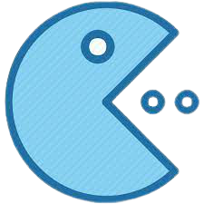
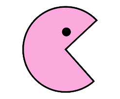

# Color-Pac

- Inpired by Pacman.
- Inspired by colors.
- The challenge is running away from randomly moving ghosts that pacman cant eat because they arent the same color.
- Spawn points, color, and movement are random.... and change!






## Layout Mock-Up vs. Finish


## How to play 🎮

> 1.  Go to [livesite](https://ruvvet.github.io).
> 2.  Pick a color of pacman to start 
> 3.  Use 'a', 'w', 's', 'd' to move pacman around
> 4.  Successfully eating a ghost of the same color will add +1 to your score. Track your max score.
> 5.  Computer ghosts will change color and direction randomly.
> 6.  Computer ghosts will randomly be added.
> 7.  Eating a ghost of a different color will -1 to your life. Game over when you lose all your lives


### SCREENSHOTS


# CODE SNIPPETS

### Game Dynamic Intervals 

Multiple timing intervals set upon starting the game to allow for an engaging player experience

```javascript
    //timer for player movement speed, renderings, and collission checks
    change = setInterval(gameLoop, 120);
    //timer for computer movement speed
    change1 = setInterval(gameLoop1, 500);
    //timer for all computers to change to a random color
    changeC = setInterval(changeColor, 5000);
    //timer for all computers to change to a random direction
    changeD = setInterval(changeDirection, 2500);
    //timer to add an additional ghost in the mix   
    addBubbles = setInterval(addComputerBubble, 2000);
```


### Primary Game Loop on Canvas 

Main game loop for clearing the canvas, and rendering computers and players, as well as checking for collissions. 
Other loops set up for changing fields of the computers..

```javascript
function gameLoop() {
    //if alive
    if (lifePoints > 0) {
        //clear canvas
        ctx.clearRect(0, 0, game.width, game.height);
        //draw player
        player.render();
        //draw computers
        for (let i = 0; i < computerBubbles.length; i++) {
            computerBubbles[i].render();
        }

        //can optionally draw a grid
        //drawGrid();

        //check if the player ate a ghost, and the right one
        checkPlayerCollision();

        //update score, life, and max score
        scoreDisplay[0].textContent = "Score: " + score;
        lifeDisplay.textContent = "Life: " + lifePoints;
        maxScoreDisplay[0].textContent = "Max Score: " + localStorage.getItem('maxScore');
    }
}
```

### Checking pacman and ghost encounters

Checks whether pacman and the ghost colors match and update scores, life, and play sound effects to reflect it!

```javascript
//check for player collision - update score, life, and play sounds affect based on same color ghost as pacman or not
function checkPlayerCollision() {
    //Check if any other computer are occupying that space
    for (let i = 0; i < computerBubbles.length; i++) {
        //if they bump into a computer
        if (computerBubbles[i].computerX === player.playerX &&
            computerBubbles[i].computerY === player.playerY) {
            //if its the same color
            if (computerBubbles[i].color === player.color) {
                scoreSound.volume = 0.2;
                scoreSound.play();
                score++;
                if (score > maxScore) {
                    maxScore = score;
                    maxScoreString = maxScore.toString();
                    localStorage.setItem("maxScore", maxScoreString);
                }
                computerBubbles[i] = new Computer();

            }
            else {
                lifePoints--;
                hurtSound.volume = 0.1;
                hurtSound.play();
                computerBubbles[i] = new Computer();
            }
        }
        //...continues..
```

### Game Units

Everything is scaled based on the canvas height and width into a universal unit size, allowing for flexibility in adjusting the canvas. Can be helpful for future conversion to adapt to different devices.

```javascript

//canvas attributes
let gameCanvas = document.querySelector('#game');
let canvasHeight = getComputedStyle(gameCanvas)['height'];
let canvasWidth = getComputedStyle(gameCanvas)['width'];
let intHeight = parseInt(canvasHeight);
let intWidth = parseInt(canvasWidth);

//hard coded unit size that can be adjusted
let unitSize = 25;

//player and computer locations all based on unit size and canvas specs
this.playerX = (Math.round(intWidth / unitSize / 2)) * unitSize;
this.playerY = (Math.round(intHeight / unitSize / 2)) * unitSize;
this.computerX = Math.round(Math.random() * intWidth / unitSize) * unitSize;
this.computerY = Math.round(Math.random() * intHeight / unitSize) * unitSize;
ctx.drawImage(ghostImage, this.computerX, this.computerY, unitSize, unitSize)

```


## Reflection
- Planning process is so important for effective code sessions. CSS - sketching out div blocks and wire-frames. JS - user story and writing out individual functions 
- Setting up code for the ability to revise or add functionality. Trying my best to isolate changes to one or only a few locations when adjusting functionality. 
- Breaking down canvas movements to the most basic logic was fun to see - makes you think anything is possible!


# List of classes and functions
| **CLASSES**                                | **Description**                                                      |
| ------------------------------------------ | -------------------------------------------------------------------- |
| `class Player`                            | Initializes a location, size, and image for rendering, as well as a field for degree of rotation for the image|
| `class Computer`                      | Initializes a location and size for rendering. Initializes a random color and direction for movement                           |

| **FUNCTIONS**                                                         | **Description**                                                                                                              |
| --------------------------------------------------------------------- | ---------------------------------------------------------------------------------------------------------------------------- |
| `Player.render()`                                                              | takes in a degree of rotation and draw a rotated image on the canvas                              |
| `Computer.render()`             | calls a           `getGhost()` function to get an image and then draws it on the canvas                      |
| `getPacman(color)`                                                            | Takes a color as a parameter and returns a corresponding pacman image for that color             |
| `getGhost(colors)`                                                       | Take a color as a parameter and returns a ghost            |
| `keyAdapter(e)`                                                    | Takes in user input and increments the Player object x and y fields if within canvas. Also adjusts the degRotate field of the Player for rendering a rotated image                                 |
| `movementHandler()`                                                | Loops through the Computer objects array and based on their direction field, increment their x and y field if within canvas                      |
| `checkPlayerCollision()` | Loops through the Computer object array and check if they are intersecting with the Player. Update score/life, play sound effects, and update maxScore depending on if the colors are the same. Create a new instance of the Computer object to update the array to 'regenerate' the Computer ghost. Change interface once lifePoints reach 0 |
| `gameLoop()`                                                            | Main game loop on a Interval - renders Player and Computer objects. Call the `checkPlayerCollision()` function and update scoreboard.                                          |
| `gameLoop1()`                                              | Game loop that is on an Interval updating the Computer movements (different speed from the player)          |
| `gameLoop()`                                                          | The primary gameloop that checks game state and then renders, updates, and calls next frame to be painted                    |
| `changeDirection()`                                                      | Loops through the array of Computer objects and changes their direction to a random one; used on a Interval          |
| `changeColor()`                                                              | Loops through the array of Computer objects and changes their color to a random one; used on a Interval               |
| `addComputerbubble()`                                                        | Creates a new Computer object and adds it to an existing computer array                              |